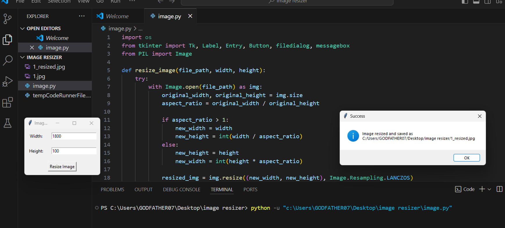

# Image-Resizer

Explanation:

1. Import Libraries:

tkinter: For creating the GUI for user input and file selection.

os: For handling file paths.

PIL (Pillow): For opening, manipulating, and saving image files.

2. Function Definitions:

resize_image(file_path, width, height):

Opens the image file.

Calculates the new dimensions while maintaining the aspect ratio.

Resizes the image using Image.Resampling.LANCZOS (updated from ANTIALIAS).

Saves the resized image with a modified file name.

Displays a success or error message as appropriate.

File Selection and Resizing Functions:

3. select_file(): Opens a file dialog for the user to select an image file.

4. start_resizing(): Retrieves user input for dimensions and calls the resize_image function with the selected file path and dimensions.

5. Tkinter GUI:

Labels and Entry Widgets: For user input of width and height.

Button: To trigger the resizing process.

Tkinter Event Loop: Runs the GUI application.
